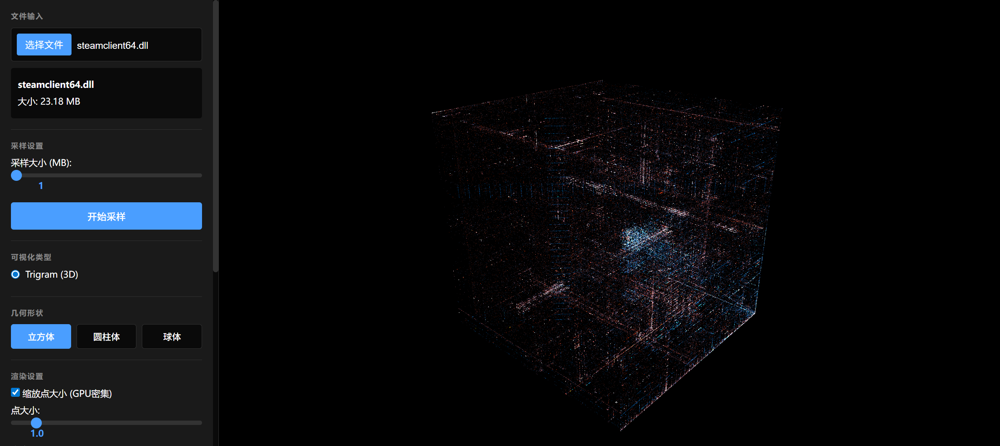

# BinaryVis

<div align="center">
  

  **Binary Data 3D Visualization System**

  Built with Rust Backend + Three.js Frontend

  [](LICENSE)
  [](https://www.rust-lang.org/)
  [](https://nodejs.org/)

  English | [简体中文](README_CN.md)
</div>

---

## Overview

BinaryVis is a web-based 3D visualization tool for binary data that helps users identify patterns and structures in binary files by mapping data to 3D space.

> **Inspired by**: This project is inspired by [Veles](https://github.com/codilime/veles) and reimplements binary visualization using modern web technologies.

### Key Features

- **Trigram 3D Visualization**: Maps consecutive 3 bytes to 3D coordinates
- **File Fingerprinting**: Automatic duplicate detection to avoid re-uploading same files
- **Real-time Sampling**: Intelligent downsampling for large files (up to 128MB)
- **Multiple Geometries**: Cube, cylinder, sphere with smooth transitions
- **Streaming Transfer**: WebSocket-based real-time data transfer
- **High-Performance Rendering**: Supports tens of millions of points
- **Internationalization**: Auto-detects browser language (Chinese/English)

## Tech Stack

### Backend
- Rust 1.75+
- Axum 0.7+ (Web framework)
- Tokio (Async runtime)
- Rayon (Parallel processing)
- MessagePack (Data serialization)

### Frontend
- Vite 5.0 (Build tool)
- Three.js r160+ (3D rendering)
- JavaScript ES2022
- Vanilla CSS

## Quick Start

### Requirements

- Rust 1.75+ (1.75 or higher recommended)
- Node.js 18+
- npm or yarn

### One-Click Start (Recommended)

```bash
# Run the startup script in project root
./start.sh
```

The script will automatically:
1. Start backend server (runs in background)
2. Install frontend dependencies (if needed)
3. Start frontend dev server

Frontend will be available at `http://localhost:5173` (automatically opens in browser)

### Manual Start

#### 1. Start Backend

```bash
cd backend

# Create upload directory
mkdir -p uploads

# Run backend server (development mode)
cargo run

# Or build and run release version
cargo build --release
cargo run --release
```

Backend server will start at `http://0.0.0.0:3000`

#### 2. Start Frontend

```bash
cd frontend

# Install dependencies
npm install

# Start development server
npm run dev
```

Frontend dev server will start at `http://localhost:5173`

### Usage

1. Open browser and navigate to `http://localhost:5173`
2. **Upload File**: Click "Choose File" button to select a binary file
3. **Set Sample Size**: Use slider to adjust sample size (1-128 MB)
4. **Start Sampling**: Click "Start Sampling" button and wait for WebSocket streaming
5. **View Visualization**: After data loads, it will automatically render as 3D point cloud
6. **Adjust Display**: Use control panel to adjust visualization parameters:
   - **Geometry Shape**: Cube, cylinder, sphere (smooth transitions)
   - **Point Size**: Adjust rendering size of points
   - **Brightness**: Control point brightness
   - **Color Gradient**: Start and end colors
   - **Scale Mode**: Enable/disable depth scaling

### Performance Notes

- **Max 50M Points**: Supports up to 50 million points
- **Real-time Rendering**: GPU-accelerated with WebGL
- **Streaming Transfer**: WebSocket chunks of 256KB each
- **Smart Sampling**: Auto-downsamples large files to specified size

## Configuration

### Backend Configuration

Edit `backend/.env`:

```env
PORT=3000
UPLOAD_DIR=./uploads
MAX_FILE_SIZE=10737418240      # 10GB
MAX_SAMPLE_SIZE=134217728      # 128MB
CACHE_SIZE=536870912           # 512MB
MAX_CONNECTIONS=100
RUST_LOG=info
```

### Frontend Configuration

Edit `frontend/src/config.js`:

```javascript
export const CONFIG = {
  API_URL: 'http://localhost:3000/api',
  WS_URL: 'ws://localhost:3000/ws',
  MAX_FILE_SIZE: 10 * 1024 * 1024 * 1024, // 10GB
  MAX_SAMPLE_SIZE: 128 * 1024 * 1024,     // 128MB
  DEFAULT_SAMPLE_SIZE: 1 * 1024 * 1024,   // 1MB
};
```

## API

### HTTP API

- `GET /api/check?fingerprint={fp}` - Check if file fingerprint exists
- `POST /api/upload` - Upload file (multipart/form-data with fingerprint)
- `GET /api/files/:id` - Get file information
- `DELETE /api/files/:id` - Delete file
- `POST /api/sample/:id` - Synchronous sampling (for small data)
- `GET /api/health` - Health check
- `GET /api/metrics` - Get cache and performance metrics

### WebSocket API

- `ws://localhost:3000/ws/:file_id` - WebSocket connection
- **Message Format**: MessagePack (Map format) encoding
- **Control Commands**:
  - `sample` - Request sample data
- **Data Transfer**: Chunked streaming, 256KB per chunk

See [docs/API_DESIGN.md](docs/API_DESIGN.md) for detailed API documentation

## Performance Metrics

| Metric | Target |
|--------|--------|
| Max File Size | 10 GB |
| Max Sample Size | 128 MB |
| Target FPS | 60 FPS |
| Sampling Latency | < 500ms (1GB → 1MB) |

## Design Principles

- **Fast-Fail**: Fail immediately on errors, no fallback
- **Minimal Dependencies**: Only use necessary libraries
- **High Performance**: Supports tens of millions of points in real-time
- **Simple Architecture**: Direct frontend-backend connection
- **Smart Deduplication**: File fingerprinting to avoid duplicate uploads

## Project Highlights

### Technical Features

1. **File Fingerprinting**:
   - Fingerprint based on filename hash + size + modification time
   - Frontend pre-check to avoid duplicate uploads
   - Fingerprint as filename for natural deduplication
   - Persistent storage, survives page refresh

2. **High-Performance Sampling**:
   - `memmap2` memory-mapped files to avoid full loading
   - Rayon parallel processing for faster sampling
   - LRU cache to reduce redundant computation

3. **Streaming Data Transfer**:
   - WebSocket bidirectional communication
   - MessagePack binary serialization (30-50% smaller than JSON)
   - 256KB chunks for balanced latency and throughput

4. **GPU-Accelerated Rendering**:
   - Custom GLSL shaders
   - Three.js `BufferGeometry` for efficient rendering
   - Additive blending for brightness accumulation

5. **Internationalization**:
   - Auto-detects browser language
   - Supports Chinese/English interface
   - Page title and description auto-switch

### Architecture Features

- **Frontend-Backend Separation**: Rust backend + JavaScript frontend
- **Minimal Dependencies**: Only essential libraries
- **Vanilla Stack**: Frontend uses native JavaScript + CSS, no frameworks
- **Type Safety**: Rust provides compile-time type checking

## Troubleshooting

### Backend Issues

1. **Port Already in Use**: Change `PORT` in `.env`
2. **Upload Directory Permissions**: Ensure `uploads` directory is writable
3. **Missing Dependencies**: Run `cargo build` to reinstall

### Frontend Issues

1. **Cannot Connect to Backend**: Check if backend is running, verify URL config
2. **WebSocket Connection Failed**: Check firewall settings
3. **Poor Rendering Performance**: Reduce sample size, check graphics drivers

## License

This project is licensed under the Apache 2.0 License. See [LICENSE](LICENSE) for details.

## References

This project is inspired by [Veles](https://github.com/codilime/veles) - an open-source binary analysis and visualization tool developed by CodiLime.

### Acknowledgements

Thanks to the [Veles](https://github.com/codilime/veles) project for its excellent design concepts and visualization principles. BinaryVis maintains the core visualization principles while adopting modern web technologies for easier deployment and use.
